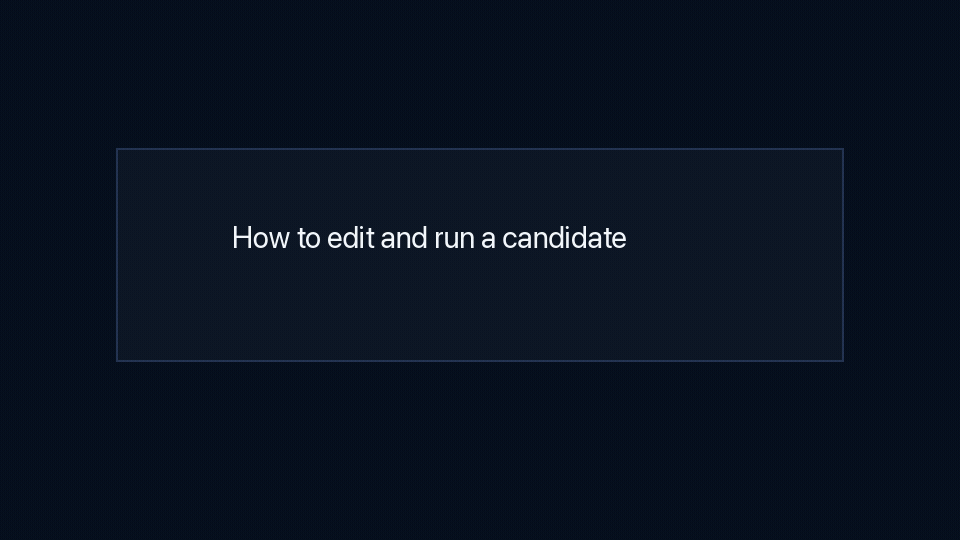

# speedrun-dlm: A speedrun benchmark for diffusion language models

**Train a diffusion language model (DLM) as fast as possible to generate decent text.**

This repository asks how quickly one can train a diffusion language model on
*FineWeb*, using *8 H100s*, until it generates 1024-token samples that are good
enough to pass a simple quality gate.

The **gate** checks for:
- too much repetition,
- basic document coherence,
- quality according to a pinned reference LLM (`Qwen2.5-7B`),
- other simple heuristics (more details below).

The project is inspired by Keller Jordan and collaborators' **[modded-nanogpt](https://github.com/KellerJordan/modded-nanogpt) speedrun, adapted to diffusion language models**, where many core design choices are still open.

We fix a small DDiT backbone (170M parameters) and include re-implementations of **7 common single-block diffusion objectives** in `speedrun_dlm/train_dlm.py`.

> Note. Original methods and ideas belong to their respective authors. This is an independent project and is not affiliated with modded-nanogpt, its contributors, or the authors of the papers we cite.


## Contents

- [Leaderboard](#leaderboard)
- [Rules](#rules)
- [Model](#model)
- [Quality gate](#quality-gate)
- [How to submit](#how-to-submit)
- [Run](#run)
- [Check a candidate](#check-a-candidate)
- [Appendix](APPENDIX.md)

## Leaderboard

**Runs are ranked by training time to pass the quality gate.**

To appear on the leaderboard, a DLM trainer+sampler must:
- pass at least 42 out of 50 seeds, and
- cost less than 95.86 TFLOPs for one 1024-token sample (this threshold is explained in the [appendix](APPENDIX.md)).

Small tuning changes, new samplers, and new objectives are all welcome.

The FLOP cap is meant to keep samplers reasonable in terms of inference cost. A diffusion sampler could otherwise try to pass the gate by using an arbitrarily large number of denoising steps.

| Rank by train time | Entry | Mean train time (used for ranking) | Gate result (need 42/50+) | 1024-token generation cost (need <95.86 TFLOPs) | Model calls for 1024 tokens | Training tokens | Training steps | Record |
| ---: | --- | ---: | ---: | ---: | ---: | ---: | ---: | --- |
| 1 | `subs_mask` | [27m45.2s](records/0001-subs-mask-s344/training_runs.jsonl) | [44/50 seeds](records/0001-subs-mask-s344/gate_passes.tsv) | [95.16 TFLOPs](records/0001-subs-mask-s344/auxiliary_metrics.json) | [344](records/0001-subs-mask-s344/auxiliary_metrics.json) | [3.28B](records/0001-subs-mask-s344/training_runs.jsonl) | [8000](records/0001-subs-mask-s344/training_runs.jsonl) | [0001](records/0001-subs-mask-s344/) |

Inference TFLOPs are FLOPs counted by PyTorch while sampling, plus the attention FLOPs PyTorch did not count. See the [appendix](APPENDIX.md) for the formula.

## Rules

- Same *data*: pinned FineWeb GPT-2 tokenized data.
- Same *scorer*: pinned `Qwen/Qwen2.5-7B`.
- Same *hardware*: 8 H100 80GB GPUs.
- Same *quality gate*: 128 unconditional samples of 1024 tokens.
- A seed passes if at least 108 out of 128 samples pass.
- A DLM sampler must cost less than 95.86 TFLOPs for one 1024-token sample.
- Runs are ranked by mean training time over 50 seeds.
- A record needs at least 42 out of 50 seeds to pass.

While architectural modifications are acceptable, the DDiT backbone parameter count should remain comparable.

## Model

The benchmark fixes a small DDiT backbone at roughly nanoGPT-2 scale:

- 12 layers,
- width 768,
- 12 heads,
- context length 1024,
- GPT-2 tokenizer.

The diffusion-specific changes are:

- non-causal attention,
- denoising-time conditioning through adaptive layer norm,
- untied input embedding and output head.


See the [appendix](APPENDIX.md) for the short comparison with the AR reference used to set the FLOP cap.

## Quality gate

**DLMs are not easy to compare** because:
- there is no direct access to the **sequence-level probability** assigned by a model: unlike for AR models, this requires estimating the sum over all possible denoising paths to reach a given sample, which is expensive and leads to high variance estimates,
- the **different losses** in current popular recipes are not directly comparable (even _if_ they constitute a variational bound of the negative log-likelihood, these bounds may have different tightness across parameterizations),
- the **sampler** used at inference time must be taken into account since the same DLM checkpoint can produce different text depending on the sampling procedure that generates sequences.

This benchmark **evaluates a trained model together with a sampler** by
<ol>
  <li> generating 128 samples of 1024 tokens each (starting from a fully noisy/masked sequence for DLMs), and </li>
  <li> checking how many of the samples pass a carefully designed quality rule (repetition, fluency, etc.). </li>
</ol>

We refer to [`score_generation_quality.py`](speedrun_dlm/score_generation_quality.py) and [`generation_quality_rule.json`](generation_quality_rule.json) for the details.

## How to submit

To get your method on the leaderboard, **open a pull request** with:

- a new folder under `records/`,
- a new row in [`records/records.csv`](records/records.csv),
- any code needed to run the method.

If you use the current trainer, sampler, and scorer outputs, you can create the record folder with [`records/make_record.py`](records/make_record.py):

```bash
python records/capture_environment.py > results/my_method/environment.json

python records/make_record.py \
  --record-dir records/nextfreeid-my-method \
  --record-id nextfreeid \
  --entry my_method \
  --trainer dlm \
  --sampler S=mysamplingsteps \
  --training-runs-jsonl results/my_method/training_runs.jsonl \
  --gate-passes-tsv results/my_method/gate_passes.tsv \
  --inference-cost-json results/my_method/inference_cost.json \
  --environment-json results/my_method/environment.json \
  --min-passes 42 \
  --records-csv records/records.csv
```

Each submitted entry should include 50 seeds, report how many seeds pass the
gate, keep an `environment.json` snapshot, and stay below 95.86 TFLOPs for one
1024-token sample. We will check the timing and record artifacts on our cluster
for each PR.

## Run



```bash
python3 -m venv .venv
source .venv/bin/activate
pip install -r requirements.txt

bash prepare_data.sh
bash run_ar.sh
bash run_dlm.sh
```

## Check a candidate

```bash
python -m speedrun_dlm.score_generation_quality path/to/checkpoint.pt \
  --samples 128 \
  --tokens 1024 \
  --top_k 0 \
  --num_sampling_steps 344 \
  --sampling_eps 1e-3 \
  --require_significance \
  --output_dir results/gate
```

```bash
python -m speedrun_dlm.measure_inference_cost path/to/checkpoint.pt \
  --tokens 1024 \
  --top_k 0 \
  --num_sampling_steps 344 \
  --sampling_eps 1e-3 \
  --output_json results/inference_cost.json
```

## Appendix

**More details on objectives, samplers, architecture, and figures are in [the appendix](APPENDIX.md).**

## Cite as

The first version of this benchmark was created by Antoine Gonon, Adrian Müller,
Léon Zheng, Zebang Shen, Clément Lalanne, Ya-Ping Hsieh, Anthony Bardou, and
Nicolas Boumal.

```bibtex
@misc{speedrun_dlm,
  title = {speedrun-dlm: A speedrun benchmark for diffusion language models},
  author = {Gonon, Antoine and Müller, Adrian and Zheng, Léon and Shen, Zebang and Lalanne, Clément and Hsieh, Ya-Ping and Bardou, Anthony and Boumal, Nicolas},
  year = {2026}
}
```

## Contact

For private questions or feedback, feel free to reach out to `antoine.gonon@epfl.ch`.

For bugs, reproducibility issues, or proposed changes, please open a GitHub issue or PR.
