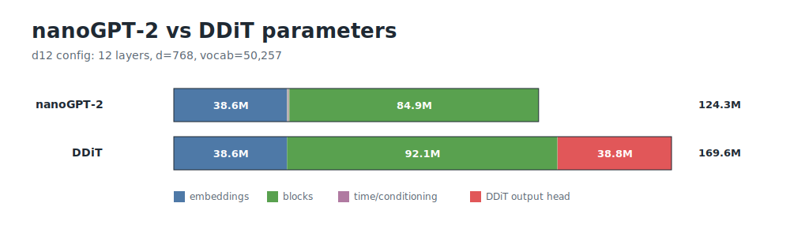

# speedrun-dlm: A speedrun benchmark for diffusion language models

**Train a diffusion language model (DLM) as fast as possible to generate decent text.**

This repository asks how quickly one can train a diffusion language model on
*FineWeb*, using *8 H100s*, until it generates 1024-token samples that are good
enough to pass a simple quality gate. 

The **gate** checks for:
- too much repetition,
- basic document coherence, 
- quality according to a pinned reference LLM (`Qwen2.5-7B`),
- other simple heuristics (more details below).

The project is inspired by Keller Jordan and collaborators' **[modded-nanogpt](https://github.com/KellerJordan/modded-nanogpt) speedrun, adapted to diffusion language models**, where many core design choices are still open. 

We started from the first commit of `modded-nanogpt`, yielding the code in `speedrun_dlm/train_ar.py` (up to minor changes). 
We then adapted it to diffusion language models in `speedrun_dlm/train_dlm.py`.

The DLM trainer is longer because it already includes our re-implementations of **7 common single-block diffusion objectives**. 

> Note. Original methods and ideas belong to their respective authors. This is an independent project and is not affiliated with modded-nanogpt, its contributors, or the authors of the papers we cite.


## Contents

- [Leaderboard](#leaderboard)
- [Rules](#rules)
- [nanoGPT-2 vs DDiT](#nanogpt-2-vs-ddit)
- [Quality gate](#quality-gate)
- [How to submit](#how-to-submit)
- [Run](#run)
- [Check a candidate](#check-a-candidate)
- [Appendix](APPENDIX.md)

## Leaderboard

**Runs are ranked by training time to pass the quality gate.**

We also include the auto-regressive (AR) nanoGPT-2 model as a reference baseline. The DLM architecture used here, DDiT, keeps the same basic shape as nanoGPT-2, with small changes needed for diffusion.

A DLM entry must **pass the gate while using less than 95.86 TFLOPs** for one 1024-token sample. 
This is the cost of the AR reference without KV cache. 
We compare to this uncached AR cost because this benchmark uses single-block full-sequence DLM samplers, for which KV caching is not possible.  

| Rank | Entry | Train time | Success rate | Training tokens | Training steps | Inference TFLOPs for 1024-token sample | Number of model calls for 1024-token sample | Record |
| --- | --- | ---: | ---: | ---: | ---: | ---: | ---: | --- |
| reference baseline | AR nanoGPT-2 | [40.6s](records/ar-baseline/training_runs.jsonl) | [49 out of 50 seeds](records/ar-baseline/gate_passes.tsv) | [131M](records/ar-baseline/training_runs.jsonl) | [500](records/ar-baseline/training_runs.jsonl) | [95.86](records/ar-baseline/auxiliary_metrics.json) (0.27 with KV cache) | [1024](records/records.csv) | [ar-baseline](records/ar-baseline/) |
| 1 | `subs_mask` | [27m45.2s](records/0001-subs-mask-s344/training_runs.jsonl) | [44 out of 50 seeds](records/0001-subs-mask-s344/gate_passes.tsv) | [3.28B](records/0001-subs-mask-s344/training_runs.jsonl) | [8000](records/0001-subs-mask-s344/training_runs.jsonl) | [95.16](records/0001-subs-mask-s344/auxiliary_metrics.json) | [344](records/records.csv) | [0001](records/0001-subs-mask-s344/) |

For DLMs, the number of model calls is simply the number of denoising steps. For the AR reference, it is the sequence length since it requires one model call per token.
Inference TFLOPs are FLOPs counted by PyTorch while sampling, plus the attention FLOPs PyTorch did not count. See the appendix for the formula.

## Rules

- Same *data*: pinned FineWeb GPT-2 tokenized data.
- Same *scorer*: pinned `Qwen/Qwen2.5-7B`.
- Same *hardware*: 8 H100 80GB GPUs.
- Same *quality gate*: 128 unconditional samples of 1024 tokens.
- A seed passes if at least 108 out of 128 samples pass.
- A DLM sampler must cost less than 95.86 TFLOPs for one 1024-token sample.
- Runs are ranked by mean training time over 50 seeds.
- A record needs at least 42 out of 50 seeds to pass.

While architectural modifications are acceptable, the DDiT backbone parameter count should remain comparable.

## nanoGPT-2 vs DDiT

The AR reference is the nanoGPT-2 shape from Karpathy's nanoGPT, as adapted in [modded-nanogpt](https://github.com/KellerJordan/modded-nanogpt):

- 12 layers,
- width 768,
- 12 heads,
- context length 1024,
- GPT-2 tokenizer.

We use this model in `speedrun_dlm/train_ar.py`, then adapt it to DLMs in `speedrun_dlm/train_dlm.py`.

**DDiT keeps the same d12 shape and makes the usual diffusion changes:**

- causal attention becomes non-causal attention,
- information about the denoising time is added through adaptive layer norm,
- input embedding and output head are untied (common for diffusion models, unlike AR models where they share weights).



Most of the gap in parameters comes from the untied output head.

_Remark on FLOPs:_ For one 1024-token model call, a DDiT call uses roughly twice the FLOPs of the AR reference (when using *no* KV cache, otherwise the AR reference is 350x lower but single-block DLMs cannot use KV cache). This extra cost is mostly due to the non-causal attention (meaning there are basically twice as many dot products to compute: ~20% of the extra cost, and twice the number of tokens to process in the linear embedding layers like qkv: ~80% of the extra cost). 

More details: [per-block parameter figure](assets/figures/architecture-params-per-layer.svg), [per-block FLOPs figure](assets/figures/architecture-flops-per-layer.svg), [extra FLOPs figure](assets/figures/architecture-additional-flops.svg).

## Quality gate

**DLMs are not easy to compare** because: 
- there is no direct access to the **sequence-level probability** assigned by a model: unlike for AR models, this requires estimating the sum over all possible denoising paths to reach a given sample, which is expensive and leads to high variance estimates,
- the **different losses** in current popular recipes are not directly comparable (even _if_ they constitute a variational bound of the negative log-likelihood, these bounds may have different tightness across parameterizations),
- the **sampler** used at inference time must be taken into account since the same DLM checkpoint can produce different text depending on the sampling procedure that generates sequences.

This benchmark **evaluates a trained model together with a sampler** by
<ol>
  <li> generating 128 samples of 1024 tokens each (starting from a fully noisy/masked sequence for DLMs), and </li>
  <li> checking how many of the samples pass a carefully designed quality rule (repetition, fluency, etc.). </li>
</ol> 

We refer to [`score_generation_quality.py`](speedrun_dlm/score_generation_quality.py)  and [`generation_quality_rule.json`](generation_quality_rule.json) for the details. 

## How to submit

**Open a pull request** with:

- a new folder under `records/`,
- a new row in [`records/records.csv`](records/records.csv),
- any code needed to run the method.

If you use the current trainer, sampler, and scorer outputs, you can create the record folder with [`records/make_record.py`](records/make_record.py):

```bash
python records/capture_environment.py > results/my_method/environment.json

python records/make_record.py \
  --record-dir records/nextfreeid-my-method \
  --record-id nextfreeid \
  --entry my_method \
  --trainer dlm \
  --sampler S=mysamplingsteps \
  --nmc mysamplingsteps \
  --training-runs-jsonl results/my_method/training_runs.jsonl \
  --gate-passes-tsv results/my_method/gate_passes.tsv \
  --inference-cost-json results/my_method/inference_cost.json \
  --environment-json results/my_method/environment.json \
  --min-passes 42 \
  --records-csv records/records.csv
```

Each submitted entry should include 50 seeds, report how many seeds pass the
gate, keep an `environment.json` snapshot, and stay below 95.86 TFLOPs for one
1024-token sample. We will check the timing and record artifacts on our cluster
for each PR.

## Run


```bash
python3 -m venv .venv
source .venv/bin/activate
pip install -r requirements.txt

bash prepare_data.sh
bash run_ar.sh
bash run_dlm.sh
```

## Check a candidate

```bash
python -m speedrun_dlm.score_generation_quality path/to/checkpoint.pt \
  --samples 128 \
  --tokens 1024 \
  --top_k 0 \
  --num_sampling_steps 344 \
  --sampling_eps 1e-3 \
  --require_significance \
  --output_dir results/gate
```

```bash
python -m speedrun_dlm.measure_inference_cost path/to/checkpoint.pt \
  --tokens 1024 \
  --top_k 0 \
  --num_sampling_steps 344 \
  --sampling_eps 1e-3 \
  --output_json results/inference_cost.json
```

## Appendix

**More details on objectives, samplers, architecture, and figures are in [the appendix](APPENDIX.md).**

## Cite as

The first version of this benchmark was created by Antoine Gonon, Adrian Müller,
Léon Zheng, Zebang Shen, Clément Lalanne, Ya-Ping Hsieh, Anthony Bardou, and
Nicolas Boumal.

```bibtex
@misc{speedrun_dlm,
  title = {speedrun-dlm: A speedrun benchmark for diffusion language models},
  author = {Gonon, Antoine and Müller, Adrian and Zheng, Léon and Shen, Zebang and Lalanne, Clément and Hsieh, Ya-Ping and Bardou, Anthony and Boumal, Nicolas},
  year = {2026}
}
```

## Contact

For private questions or feedback, feel free to reach out to `antoine.gonon@epfl.ch`.

For bugs, reproducibility issues, or proposed changes, please open a GitHub issue or PR.
